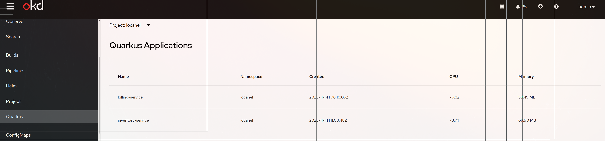

# Quarkus OpenShift Console Plugin

This project provides a [console plugin](https://github.com/openshift/console/tree/master/frontend/packages/console-dynamic-plugin-sdk) for [Quarkus](https://quarkus.io/).
The project is created using [openshift console plugin template](https://github.com/openshift/console-plugin-template)

# Local Development

For development you can login to an existing [OpenShift](https://www.redhat.com/en/technologies/cloud-computing/openshift) and run the console with the plugin included locally.
**Note**: Works well with [OpenShift Sandbox](https://developers.redhat.com/developer-sandbox).

In one terminal window, run:

```sh
yarn install
yarn run start
```

In another terminal window, run:

After running `oc login` (requires [oc](https://console.redhat.com/openshift/downloads) and an [OpenShift cluster](https://console.redhat.com/openshift/create))

```sh
yarn run start-console
```
(requires [Docker](https://www.docker.com) or [podman 3.2.0+](https://podman.io))


This will run the OpenShift console in a container connected to the cluster
you've logged into. The plugin HTTP server runs on port 9001 with CORS enabled.
Navigate to <http://localhost:9000/example> to see the running plugin.

# Deployment to OpenShift

To deploy the console plugin to an actual [OpenShift](https://www.redhat.com/en/technologies/cloud-computing/openshift) cluster the following are needed:

- [oc](https://console.redhat.com/openshift/downloads)
- [helm](https://helm.sh)

### Building the images locally

```sh
docker build -t docker.io/iocanel/quarkus-openshift-console-plugin:latest .
docker push docker.io/iocanel/quarkus-openshift-console-plugin:latest
```

**Note**: The image `docker.io/iocanel/quarkus-openshift-console-plguin:latest` is published so it can be pulled instead.

### Deploying the plugin using Helm

```sh
oc new-project plugin-quarkus-openshift-console-plugin
helm upgrade -i  quarkus-openshift-console-plugin charts/openshift-console-plugin --namespace plugin-quarkus-openshift-console-plugin --set plugin.image=docker.io/iocanel/quarkus-openshift-console-plugin:latest
```

# The Quarkus Tab

In the developer perpective the Quarkus section is now shown:
[](screenshots/home.png)
